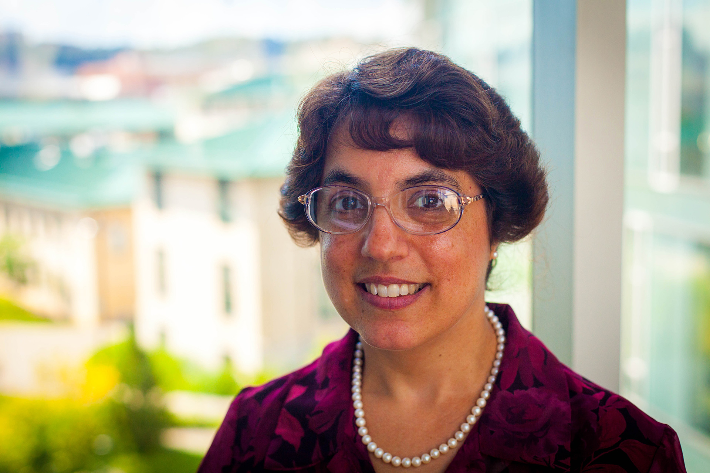
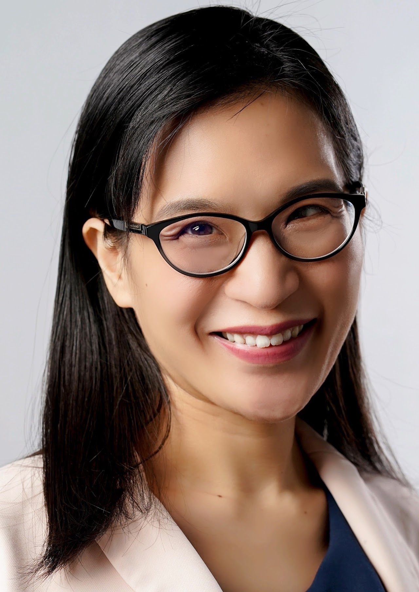
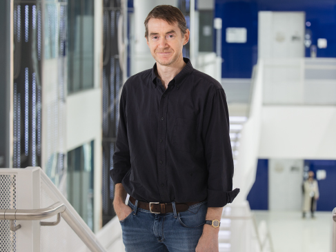

# Invited Speakers

<!-- # Speaker Details

TBD -->

 [Carolyn Rosé](https://www.cs.cmu.edu/~cprose/)  (Carnegie Mellon University, USA)

**Talk**: _Chasing Our Tail? The Quest for Effective Representations for Domain Transfer_

**Bio**: Dr. Carolyn Rosé is a Professor of Language Technologies and Human-Computer Interaction in the School of Computer Science at Carnegie Mellon University.  Her research program focuses on computational modeling of discourse to enable scientific understanding the social and pragmatic nature of conversational interaction of all forms, and using this understanding to build intelligent computational systems for improving collaborative interactions. Her research group’s highly interdisciplinary work, published in over 300 peer reviewed publications, is represented in the top venues of 5 fields: namely, Language Technologies, Learning Sciences, Cognitive Science, Educational Technology, and Human-Computer Interaction, with awards in 4 of these fields.  She is a Past President and Inaugural Fellow of the International Society of the Learning Sciences, Senior member of IEEE, Founding Chair of the International Alliance to Advance Learning in the Digital Era, and Co-Editor-in-Chief of the International Journal of Computer-Supported Collaborative Learning. She also serves as a 2020-2021 AAAS Leshner Leadership Institute Fellow for Public Engagement with Science, with a focus on public engagement with Artificial Intelligence.

 

 [Nancy F. Chen](http://alum.mit.edu/www/nancychen) (A*STAR, Singapore)

**Talk**: _Personalized Large Language Models for Inclusive AI: From Multicultural Reasoning to Customized Coaching_

**Bio**: Nancy F. Chen is an A*STAR fellow, senior principal scientist, principal investigator, and group leader at I2R (Institute for Infocomm Research) and Principal Investigator at CFAR (Centre for Frontier AI Research). Her group works on generative AI in speech, language, and conversational technology. Her research has been applied to education, defense, healthcare, and media/journalism. Dr. Chen has published 100+ papers and supervised 100+ students/staff. She has won awards from IEEE, Microsoft, NIH, P&G, UNESCO, L’Oréal, SIGDIAL, APSIPA, MICCAI. She is an IEEE SPS Distinguished Lecturer (2023-2024), Program Chair of ICLR 2023, Board Member of ISCA (2021-2025), and Singapore 100 Women in Tech (2021). Technology from her team has led to commercial spin-offs and government deployment. Prior to A*STAR, she worked at MIT Lincoln Lab while doing a PhD at MIT and Harvard.
 

 [Timothy Baldwin](https://mbzuai.ac.ae/study/faculty/timothy-baldwin/) (MBZUAI, UAE)

**Talk**: _TBA_

**Bio**: Timothy Baldwin is the Acting Provost, Associate Provost for Academic Affairs, and Professor of Natural Language Processing at MBZUAI. Prior to joining MBZUAI, Baldwin spent 17 years at The University of Melbourne, including roles as Melbourne Laureate Professor, Director of the ARC Training Centre in Cognitive Computing for Medical Technologies (in partnership with IBM), Associate Dean Research Training in the Melbourne School of Engineering, and Deputy Head of the Department of Computing and Information Systems. He has previously held visiting positions at Cambridge University, University of Washington, University of Tokyo, Saarland University, NTT Communication Science Laboratories, and National Institute of Informatics. Prior to joining the University of Melbourne in 2004, he was a senior research engineer at the Center for the Study of Language and Information, Stanford University (2001-2004). Baldwin is president of the Association for Computational Linguistics (ACL 2022).
